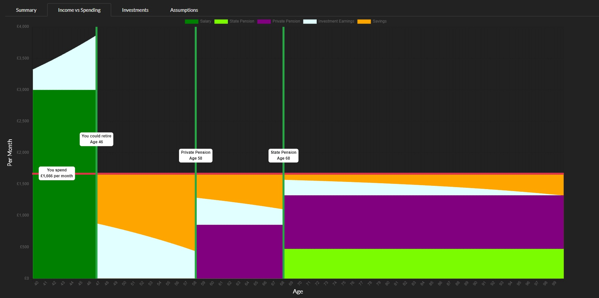

# LifeSplat-Service

A web service that projects a British persons financial future including projecting their savings and earliest feasible retirement date. 
Projections are based on the users key financial details and assumptions.

The service contains an algorithm that starts at today's date and iterates through the users future life month by month until the user hits 100 years old.
At each monthly increment basic financial information is applied to the users current financial status
e.g. the persons spending, salary, the assumption that investments will grow at 4%.

The users financial status at each monthly increment is recorded allowing for a visualisation of the users projected future.

At each increment the algorithm determines if the current financial status of the user is enough for them to maintain their current life style till their 100th birthday.
The date associated with this increment is considered the users earliest feasible retirement date.

Its important to remember that this is a projection of the users future based on their current financial status and reasonable assumptions. 
It is NOT a prediction of what will happen.

## To-do Items

* Support for users to edit the assumptions.
* Support 25% tax free lump sum
* Support life time contribution limit for private pensions.
* Support for Buy to Let and other investment types.
* Support for defined benefit pension (not sure how - possibly via a generic 'Other income Streams')
* Permitting stepped income - i.e. some users expect their income to change over time.
* Recommendations - given the users status advise them on what to do e.g. what happens if you put more in your pension? vs put more in your ISA?
* Student loans
* Scottish tax system

The potential future features are extensive, above is just an example

## Contributing

Currently LifeSplat-Service does not accept contributions. If there is demand this can change.

## License

License details can be found in [LICENSE.html](./LICENSE.html)